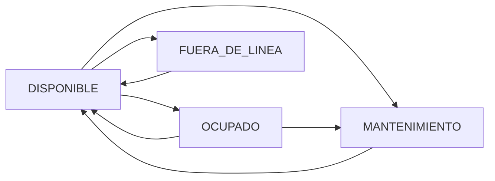

## Overview

Resource endpoints manage production resources including machines, equipment, and human resources. Resources can be assigned to work orders and tracked for utilization.

---

## GET /api/resources

Retrieve all resources with optional filtering.

**Authentication**: Required (JWT)

**Roles**: All authenticated users

### Query Parameters

<ParamField query="type" type="string">
  Filter by type: `HUMANO` or `MAQUINA`
</ParamField>

<ParamField query="status" type="string">
  Filter by status: `DISPONIBLE`, `OCUPADO`, `MANTENIMIENTO`, or `FUERA_DE_LINEA`
</ParamField>

<ParamField query="search" type="string">
  Search by name or sector
</ParamField>

### Response

Returns an array of resource objects.

<ResponseField name="id" type="string">
  Resource unique identifier
</ResponseField>

<ResponseField name="companyId" type="string">
  Associated company ID
</ResponseField>

<ResponseField name="type" type="string">
  Resource type: `HUMANO` or `MAQUINA`
</ResponseField>

<ResponseField name="name" type="string">
  Resource name
</ResponseField>

<ResponseField name="sector" type="string">
  Work sector or area
</ResponseField>

<ResponseField name="status" type="string">
  Current status: `DISPONIBLE`, `OCUPADO`, `MANTENIMIENTO`, or `FUERA_DE_LINEA`
</ResponseField>

<ResponseField name="notes" type="string">
  Additional notes
</ResponseField>

<ResponseField name="isActive" type="boolean">
  Whether the resource is active
</ResponseField>

<ResponseField name="createdAt" type="string">
  ISO 8601 timestamp of creation
</ResponseField>

<ResponseField name="updatedAt" type="string">
  ISO 8601 timestamp of last update
</ResponseField>

<CodeGroup>
```bash cURL
curl -X GET "https://api.example.com/api/resources?type=MAQUINA&status=DISPONIBLE" \
  -H "Authorization: Bearer YOUR_JWT_TOKEN"
```

```javascript JavaScript
const response = await fetch(
  'https://api.example.com/api/resources?type=MAQUINA&status=DISPONIBLE',
  {
    headers: {
      'Authorization': `Bearer ${accessToken}`
    }
  }
);

const resources = await response.json();
```
</CodeGroup>

---

## POST /api/resources

Create a new resource.

**Authentication**: Required (JWT)

**Roles**: `DUENO`, `SUPERVISOR`, `ADMIN`

### Request Body

<ParamField body="type" type="string" required>
  Resource type: `HUMANO` or `MAQUINA`
</ParamField>

<ParamField body="name" type="string" required>
  Resource name (max 120 characters)
</ParamField>

<ParamField body="sector" type="string">
  Work sector or area (max 120 characters)
</ParamField>

<ParamField body="status" type="string">
  Initial status: `DISPONIBLE`, `OCUPADO`, `MANTENIMIENTO`, or `FUERA_DE_LINEA` (default: `DISPONIBLE`)
</ParamField>

<ParamField body="notes" type="string">
  Additional notes (max 500 characters)
</ParamField>

### Response

Returns the created resource object.

<CodeGroup>
```bash cURL
curl -X POST https://api.example.com/api/resources \
  -H "Authorization: Bearer YOUR_JWT_TOKEN" \
  -H "Content-Type: application/json" \
  -d '{
    "type": "MAQUINA",
    "name": "Soldadora MIG 300A",
    "sector": "Taller de Soldadura",
    "status": "DISPONIBLE",
    "notes": "Adquirida en 2024, requiere mantenimiento trimestral"
  }'
```

```javascript JavaScript
const response = await fetch('https://api.example.com/api/resources', {
  method: 'POST',
  headers: {
    'Authorization': `Bearer ${accessToken}`,
    'Content-Type': 'application/json'
  },
  body: JSON.stringify({
    type: 'MAQUINA',
    name: 'Soldadora MIG 300A',
    sector: 'Taller de Soldadura',
    status: 'DISPONIBLE'
  })
});

const resource = await response.json();
```
</CodeGroup>

---

## PATCH /api/resources/:id

Update an existing resource.

**Authentication**: Required (JWT)

**Roles**: `DUENO`, `SUPERVISOR`, `ADMIN`

### Path Parameters

<ParamField path="id" type="string" required>
  Resource ID to update
</ParamField>

### Request Body

All fields are optional. Only include fields to update.

<ParamField body="name" type="string">
  Resource name (max 120 characters)
</ParamField>

<ParamField body="sector" type="string">
  Work sector or area (max 120 characters)
</ParamField>

<ParamField body="status" type="string">
  Status: `DISPONIBLE`, `OCUPADO`, `MANTENIMIENTO`, or `FUERA_DE_LINEA`
</ParamField>

<ParamField body="notes" type="string">
  Additional notes (max 500 characters)
</ParamField>

### Response

Returns the updated resource object.

<CodeGroup>
```bash cURL
curl -X PATCH https://api.example.com/api/resources/clx1234567890 \
  -H "Authorization: Bearer YOUR_JWT_TOKEN" \
  -H "Content-Type: application/json" \
  -d '{
    "status": "MANTENIMIENTO",
    "notes": "En mantenimiento preventivo programado"
  }'
```

```javascript JavaScript
const response = await fetch(
  `https://api.example.com/api/resources/${resourceId}`,
  {
    method: 'PATCH',
    headers: {
      'Authorization': `Bearer ${accessToken}`,
      'Content-Type': 'application/json'
    },
    body: JSON.stringify({
      status: 'MANTENIMIENTO',
      notes: 'En mantenimiento preventivo programado'
    })
  }
);

const resource = await response.json();
```
</CodeGroup>

---

## DELETE /api/resources/:id

Delete a resource (soft delete - sets isActive to false).

**Authentication**: Required (JWT)

**Roles**: `DUENO`, `SUPERVISOR`, `ADMIN`

### Path Parameters

<ParamField path="id" type="string" required>
  Resource ID to delete
</ParamField>

### Response

Returns the deactivated resource object.

<CodeGroup>
```bash cURL
curl -X DELETE https://api.example.com/api/resources/clx1234567890 \
  -H "Authorization: Bearer YOUR_JWT_TOKEN"
```

```javascript JavaScript
const response = await fetch(
  `https://api.example.com/api/resources/${resourceId}`,
  {
    method: 'DELETE',
    headers: {
      'Authorization': `Bearer ${accessToken}`
    }
  }
);

const result = await response.json();
```
</CodeGroup>

<Note>
  This is a soft delete operation. The resource record remains in the database with `isActive` set to `false`. Historical assignments are preserved.
</Note>

---

## GET /api/resources/status

Check the resources service status.

**Authentication**: None (public endpoint)

### Response

<ResponseField name="status" type="string">
  Service status
</ResponseField>

---

## Resource Types

The system supports two resource types:

<CardGroup cols={2}>
  <Card title="HUMANO" icon="user">
    Human resources (operators, technicians, supervisors)
  </Card>
  
  <Card title="MAQUINA" icon="gear">
    Machine resources (equipment, tools, production machinery)
  </Card>
</CardGroup>

## Resource Status Flow

Resources typically flow through these statuses:



<Expandable title="Status Descriptions">
  - **DISPONIBLE**: Resource is available for assignment
  - **OCUPADO**: Resource is currently assigned to a work order
  - **MANTENIMIENTO**: Resource is under maintenance
  - **FUERA_DE_LINEA**: Resource is offline or unavailable
</Expandable>
