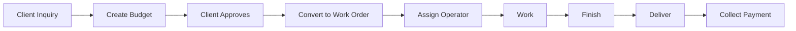

<Info>
**Role:** Owner/Admin  
**Access Level:** FULL — All system features  
**Responsibility:** Strategic decision-making based on real workshop data
</Info>

## What the System Gives You

DRAIT Mini-MES transforms your workshop into actionable information:

<CardGroup cols={2}>
  <Card title="Before" icon="question">
    - "I don't know how long that part took"
    - "I don't know if we're making money"
    - "I don't know who's working on what"
    - "Control is in the supervisor's head"
  </Card>
  <Card title="Now" icon="check">
    - Exact hours recorded by operators
    - Estimated monthly margin on Dashboard
    - Real-time dispatch center
    - Everything recorded, auditable, and queryable
  </Card>
</CardGroup>

---

## Executive Dashboard

The **first screen** you see after login. Gives you a 360° view of your workshop.

### Accessing the Dashboard

<Steps>
  <Step title="Login to system">
    Enter your credentials at the login screen
  </Step>
  <Step title="View Dashboard">
    You'll automatically land on the Executive Dashboard showing real-time KPIs
  </Step>
</Steps>

### Period Selector

The **3M / 6M / 12M** buttons filter all data for the selected period. Use this to compare quarters or see the year's trend.

<Tip>
Toggling between periods updates all charts and metrics instantly, allowing you to spot trends and seasonal patterns.
</Tip>

### Production KPIs (Top Row)

The dashboard displays 6 key metrics in the top row:

| KPI | What It Tells You |
|-----|-------------------|
| **Open Orders** | Total pending work |
| **In Process** | Operators working right now |
| **Delayed** | ⚠️ Work orders past due date — require attention |
| **Closed** | Orders completed in the period |
| **Avg Time/Order** | Efficiency per order |
| **Active Operators** | Team utilization |

### Estimated Financial Summary

<Warning>
Values are **estimates** based on registered budgets and consumptions. More complete your records, more accurate the data.
</Warning>

| Metric | How It's Calculated |
|--------|---------------------|
| **Estimated Revenue** | Sum of budget values from closed work orders |
| **Estimated Profit** | Orders where real cost < budgeted price |
| **Estimated Loss** | Orders where real cost > budgeted price |
| **Real Material Cost** | Sum of all registered consumptions |
| **Net Margin** | Profit - Loss |

### Interactive Charts

The dashboard provides four key visualizations:

<Accordion title="Monthly Trend Chart">
  **Line chart** showing orders closed and average hours per order over time.
  
  - Orange line: Orders closed per month
  - Blue line: Average hours per order
  - Use to identify if the workshop is closing more or fewer orders
  - Track if hours per order are increasing (potential efficiency issues)
</Accordion>

<Accordion title="Current Status (Donut Chart)">
  **Pie chart** showing distribution of orders by status.
  
  - Visual breakdown: Pending, Planned, In Process, Paused, Finished, etc.
  - Percentages show where orders accumulate
  - Helps identify bottlenecks
</Accordion>

<Accordion title="Income vs Material Cost">
  **Bar chart** comparing monthly revenue against material costs.
  
  - Blue bars: Estimated income
  - Orange bars: Material costs
  - Shows the gap between what you bill and what you spend on supplies
</Accordion>

<Accordion title="Monthly Margin">
  **Stacked bar chart** showing profit and loss by month.
  
  - Green bars: Profitable orders (gain)
  - Red bars: Loss-making orders
  - Good months (green) vs months with losses (red)
</Accordion>

### Operational Alerts

Automatic alert system for deviations:

- 🟡 **Warning**: Work order exceeded 80% of estimated time without closing
- 🔴 **Critical**: Work order significantly exceeded estimated time or cost

<Note>
Alerts appear in the hero section at the top of the Dashboard and in the dedicated "Operational Alerts" panel.
</Note>

---

## User Management

<Warning>
User management is **only visible** to Owner/Admin roles.
</Warning>

Access from the menu → **"Users"**

### Creating a New User

<Steps>
  <Step title="Open user creation dialog">
    Click **"+ New User"** button in the top-right of the Users page
  </Step>
  <Step title="Fill in user details">
    Complete:
    - Full name
    - Email (used for login)
    - Role (see roles table below)
    - Initial password (minimum 8 characters)
  </Step>
  <Step title="Save the user">
    Click **"Create User"**. The operator can log in immediately.
  </Step>
</Steps>

### Available Roles

| Role | Description | Access Level |
|------|-------------|-------------|
| **Operator** | Only sees assigned work orders. No Dashboard or management access | Limited |
| **Supervisor** | Access to everything except Users and Audit. Can manage work orders and dispatch work | High |
| **Owner** | Full access. Only role that can create/suspend users and view audit history | Complete |
| **Admin** | Same as Owner. For technical system personnel | Complete |

<Tip>
The system shows a role description in the user creation form to help you select the appropriate access level.
</Tip>

### Changing a User's Role

From the users table, use the role selector dropdown in the Actions column. **The change is immediate** — no confirmation needed.

### Suspending a User

If an operator leaves the workshop or is on leave:

<Steps>
  <Step title="Find the user">
    Locate the user in the users table
  </Step>
  <Step title="Click Suspend">
    Click **"Suspend"** button in the user's row
  </Step>
  <Step title="Confirm suspension">
    Confirm in the dialog that appears
  </Step>
  <Step title="User is suspended">
    The user cannot access the system until you reactivate them using the **"Activate"** button
  </Step>
</Steps>

---

## Audit History

<Warning>
Audit History is **only visible** to Owner/Admin roles.
</Warning>

Access from the menu → **"Audit"**

Shows **every action** performed in the system with:

- Exact date and time
- User who performed it and their role
- Which entity was modified (Work Order, Client, User, etc.)
- Type of action (creation, modification, status change, login, etc.)
- Value **before** and **after** the change (expandable)

### Available Filters

<CardGroup cols={2}>
  <Card title="By Entity" icon="database">
    View only changes to Work Orders, Clients, Users, etc.
  </Card>
  <Card title="By Action" icon="bolt">
    View only creations, status changes, logins, etc.
  </Card>
</CardGroup>

### Viewing Change Details

<Steps>
  <Step title="Locate the audit entry">
    Use filters or scroll through the audit table
  </Step>
  <Step title="Expand details">
    Click **"▼ View"** button in the Detail column
  </Step>
  <Step title="Review changes">
    See the **Before** and **After** JSON values showing exactly what changed
  </Step>
</Steps>

### What Is It Used For?

- Know who changed a work order status and when
- Verify if an operator registered their work start
- Audit price changes in budgets
- Verify system access (logins)
- Investigate discrepancies or disputes
- Compliance and traceability

---

## Budget and Work Order Control

### Complete Workflow

### Budget Management

From **"Budgets"** menu:

<Steps>
  <Step title="Create budget">
    Enter client, line items, and estimated values
  </Step>
  <Step title="Review with client">
    Share the budget for approval
  </Step>
  <Step title="Convert to Work Order">
    When client approves, click **"Convert to Work Order"**. A new WO is created with budget data.
  </Step>
</Steps>

### Monitoring Work Orders

From **"Orders"** menu:

<Accordion title="Filter by status and client">
  Use the control bar filters to:
  - View all work orders by status (Pending, In Process, etc.)
  - Filter by specific client
  - Search by order code or title
</Accordion>

<Accordion title="Review event history">
  Click on any work order to see:
  - Complete timeline of events (who did what and when)
  - Operator notes and comments
  - Status changes
</Accordion>

<Accordion title="View material consumptions">
  Each work order detail shows:
  - All materials consumed with quantities
  - Timestamps of consumption
  - Cost snapshot at time of consumption
</Accordion>

---

## Productivity Reports

From **"Reports"** menu you get:

<CardGroup cols={2}>
  <Card title="Hours Worked" icon="clock">
    Total hours per operator for the period
  </Card>
  <Card title="Orders Completed" icon="check-circle">
    Orders finished per operator
  </Card>
  <Card title="Hour Deviation" icon="chart-line">
    Real vs estimated time per work order
  </Card>
  <Card title="Most Productive Operator" icon="trophy">
    Efficiency ranking of your team
  </Card>
</CardGroup>

### Using Productivity Data

<Steps>
  <Step title="Access Reports page">
    Click **"Reports"** in the navigation menu
  </Step>
  <Step title="Review alerts">
    Check the alerts section for orders with significant time or cost deviations
  </Step>
  <Step title="Analyze operator performance">
    View hours worked by each operator and compare to orders completed
  </Step>
  <Step title="Identify problem orders">
    Sort by time or cost deviation to find orders that exceeded estimates
  </Step>
</Steps>

---

## Basic System Management

### Clients

Manage your complete portfolio from **"Clients"** menu:

- Name, Tax ID (CUIT), email, phone
- Add new clients with **"+ New Client"**
- Edit existing client information
- View all work orders for a specific client

### Resources

Register in **"Resources"** menu:

<CardGroup cols={2}>
  <Card title="Human Resources" icon="user">
    People linked as resources (different from system users)
  </Card>
  <Card title="Machines & Tools" icon="wrench">
    Workshop equipment: lathes, milling machines, tools, etc.
  </Card>
</CardGroup>

<Note>
Resources are assigned to work orders to track which person or machine does each job.
</Note>

### Materials

Create the **"Materials"** catalog with name and unit price:

- Operators select from this catalog when registering consumptions
- Update prices when costs change
- Track stock levels (if enabled)

---

## Management Recommendations

### Weekly

<Steps>
  <Step title="Review Dashboard">
    Check Dashboard with 3M filter to see trend
  </Step>
  <Step title="Check alerts">
    Verify **alerts**: Delayed orders need immediate attention
  </Step>
  <Step title="Review operator load">
    Check operator load: If someone is overloaded, redistribute work
  </Step>
</Steps>

### Monthly

<Steps>
  <Step title="Analyze monthly margin">
    Did it improve compared to last month?
  </Step>
  <Step title="Review loss-making orders">
    Check orders with estimated loss: What went wrong?
  </Step>
  <Step title="Adjust material prices">
    Update **material prices** if costs increased
  </Step>
</Steps>

### Before Business Meetings

<Steps>
  <Step title="Filter Dashboard by meeting period">
    Set the period selector to match your meeting timeframe
  </Step>
  <Step title="Capture charts">
    Export or screenshot income and margin charts
  </Step>
  <Step title="Use productivity data">
    Use productivity data for team negotiations and planning
  </Step>
</Steps>

---

## Frequently Asked Questions

<Accordion title="Are financial values exact?">
  They are estimates based on budgets and registered consumptions. The more complete your records, the more accurate the data. For exact accounting, reconcile with your accounting system.
</Accordion>

<Accordion title="Can I delete a work order?">
  No. Work orders are not deleted, only cancelled. This preserves traceability and audit history.
</Accordion>

<Accordion title="What if an operator breaks their phone and can't register?">
  You can register events yourself from the work order detail view as Owner/Admin.
</Accordion>

<Accordion title="Can I have multiple companies in the system?">
  Yes, the system supports multiple isolated companies. Each company needs its own deployment or a multi-tenant configuration (consult developer).
</Accordion>

<Accordion title="How do I change my password?">
  Currently password changes must be done through user management. Select your user and update credentials.
</Accordion>

<Accordion title="Can I export data to Excel?">
  The system provides visual reports. For custom exports, contact your system administrator for database access or API integration.
</Accordion>

---

## Quick Reference

### Your Exclusive Features

As an Owner/Admin, you have access to:

- ✅ User management (create, edit, suspend)
- ✅ Audit history (complete system activity log)
- ✅ Full Dashboard with financial estimates
- ✅ All reports and analytics
- ✅ Client and resource management
- ✅ Work order and budget management

### Navigation Shortcuts

| Feature | Menu Location |
|---------|---------------|
| Executive Dashboard | Home / Dashboard |
| User Management | Users |
| Audit History | Audit |
| Work Orders | Orders |
| Budgets | Quotations |
| Clients | Clients |
| Resources | Resources |
| Materials | Materials |
| Productivity Reports | Reports |

---

*DRAIT Mini-MES — Production management system for metalworking shops*