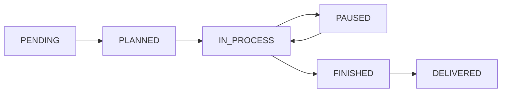

<Info>
**Role:** Supervisor  
**Access:** Dashboard, Dispatch, Orders, Clients, Budgets, Resources, Materials, Reports, My Shift  
**Responsibility:** Coordinate daily work, assign orders, and resolve operational issues
</Info>

## Your Role in the System

As a supervisor, you are the **operational coordinator** of the workshop. Your job is to:

<CardGroup cols={2}>
  <Card title="Distribute Work" icon="users">
    Assign work orders to operators based on skills and availability
  </Card>
  <Card title="Monitor Real-Time" icon="eye">
    Track what's happening in the plant right now
  </Card>
  <Card title="Detect Delays" icon="clock">
    Spot and resolve delays before they reach the client
  </Card>
  <Card title="Manage Resources" icon="wrench">
    Register workshop resources and materials
  </Card>
</CardGroup>

---

## Main Screen: The Dashboard

When you log in, you see the **Management Dashboard** with metrics for the selected period.

### Accessing the Dashboard

<Steps>
  <Step title="Login">
    Enter your supervisor credentials
  </Step>
  <Step title="View Dashboard">
    You'll land on the Dashboard showing production KPIs and charts
  </Step>
</Steps>

### Key KPIs

The top row displays 6 critical metrics:

| KPI | What It Tells You |
|-----|-------------------|
| **Open Orders** | Total active work orders in the system |
| **In Process Now** | Work orders with operators working at this moment |
| **Delayed** | ⚠️ Orders past their delivery date without closing |
| **Closed** | Orders completed in the period (3M / 6M / 12M) |
| **Avg Time/Order** | Average hours per order |
| **Active Operators** | How many are working this shift |

### Period Filter

Use the **3M / 6M / 12M** buttons to view data for the last quarter, semester, or year.

<Tip>
Toggle between periods to compare performance across different timeframes.
</Tip>

### The Charts

Four interactive visualizations help you understand workshop performance:

<Accordion title="Production Trend">
  **Line chart** showing:
  - Orders closed per month
  - Average hours per order
  
  Use this to spot efficiency trends and capacity issues.
</Accordion>

<Accordion title="Order Status (Donut)">
  **Pie chart** with distribution by status:
  - Pending, Planned, In Process, Paused, Finished, Delivered, Cancelled
  
  Helps identify where orders accumulate.
</Accordion>

<Accordion title="Income vs Cost">
  **Bar chart** comparing:
  - Estimated revenue (blue)
  - Real material cost (orange)
  
  Shows the gap between billing and material spending.
</Accordion>

<Accordion title="Monthly Margin">
  **Stacked bar chart** showing:
  - Profit (green): Orders where cost < budget
  - Loss (red): Orders where cost > budget
  
  Identifies profitable vs loss-making periods.
</Accordion>

### Alerts

If there are work orders with time or cost deviations, they appear in the **"Operational Alerts"** section with two levels:

- 🟡 **WARNING**: Near the threshold
- 🔴 **CRITICAL**: Exceeded threshold, needs immediate intervention

<Warning>
Pay close attention to critical alerts — these orders are at risk of customer complaints or financial loss.
</Warning>

---

## Dispatch Center (Supervisor)

This is **the most important screen for daily work**.

Find it in the menu → **"Dispatch"**

### What Does It Show?

<Steps>
  <Step title="Shift KPIs (Top Row)">
    Quick metrics: In Process / Paused / Delayed / Active Operators
  </Step>
  <Step title="Orders in Execution">
    Cards showing active work orders with:
    - Code + title + client
    - Status (color: green=in process, orange=paused, red=delayed)
    - Assigned operators and resources
    - Delivery date
  </Step>
  <Step title="Operators on Shift">
    List of who's working on which work order
  </Step>
  <Step title="Pending Queue">
    Next 10 work orders to dispatch, ordered by priority
  </Step>
  <Step title="Delayed Orders Table">
    Overdue orders with days late
  </Step>
</Steps>

<Info>
This screen **automatically updates every 30 seconds** to give you real-time visibility.
</Info>

### Using the Dispatch Center

<Accordion title="Morning Routine">
  1. Check how many orders are in process
  2. Review the pending queue and plan assignments
  3. Check for delayed orders requiring immediate action
</Accordion>

<Accordion title="During the Shift">
  1. Monitor operator activity in real-time
  2. Watch for paused orders and investigate reasons
  3. Respond to critical alerts
</Accordion>

<Accordion title="End of Shift">
  1. Review what was completed today
  2. Plan tomorrow's pending queue
  3. Document any issues in work order notes
</Accordion>

---

## Work Order Management

From **"Orders"** in the menu:

### Creating a Work Order

<Steps>
  <Step title="Click New Order">
    Click **"+ New Order"** button
  </Step>
  <Step title="Fill in details">
    Complete:
    - Title and description
    - Client selection
    - Delivery date
    - Priority (1=High, 2=Medium-High, 3=Normal, 4=Low)
    - Estimated hours and cost
  </Step>
  <Step title="Optional: Link to budget">
    If the order comes from an approved budget, you can link it
  </Step>
  <Step title="Save">
    Click **"Create"**. The order is now in PENDING status.
  </Step>
</Steps>

### Assigning Operators and Resources

<Steps>
  <Step title="Open the work order">
    Click on the order from the Orders list
  </Step>
  <Step title="Go to Assignments section">
    In the work order detail, find **"Assigned Resources"**
  </Step>
  <Step title="Select operator or machine">
    Choose from the dropdown of available operators and equipment
  </Step>
  <Step title="Confirm assignment">
    The operator will immediately see the work order in their "My Shift" screen
  </Step>
</Steps>

<Tip>
Assign work orders with PLANIFICADA status so operators know they're ready to start.
</Tip>

### Changing Work Order Status

Valid statuses and their flow:

You can change status from:
- The orders list (using the status selector)
- The work order detail page

<Note>
Operators trigger status changes (Start, Pause, Finish) from their interface. You can override if needed.
</Note>

### Useful Filters

<CardGroup cols={3}>
  <Card title="By Status" icon="filter">
    View only IN_PROCESS, PAUSED, FINISHED, etc.
  </Card>
  <Card title="By Client" icon="building">
    Search for orders from a specific client
  </Card>
  <Card title="By Operator" icon="user">
    See workload for a specific person
  </Card>
</CardGroup>

---

## Budget Management

From **"Budgets"** menu:

<Steps>
  <Step title="Create budget">
    Enter client, line items, and estimated values
  </Step>
  <Step title="Client approves">
    When the client approves, proceed to next step
  </Step>
  <Step title="Convert to Work Order">
    Click **"Convert to Work Order"**
  </Step>
  <Step title="Order is created">
    A new work order is created with budget data. You can now assign operators.
  </Step>
</Steps>

<Tip>
Converting a budget to a work order automatically populates estimated hours and costs.
</Tip>

---

## Workshop Resources

From **"Resources"** you can view and manage:

<Accordion title="Human Resources">
  - Operator name in the resource system (different from system user)
  - Link resources to system users for work order assignment
  - Track which operators are available
</Accordion>

<Accordion title="Machines and Tools">
  - Lathes, milling machines, equipment, etc.
  - Register all major workshop tools
  - Assign machines to work orders to track usage
</Accordion>

### Adding a Resource

<Steps>
  <Step title="Go to Resources">
    Click **"Resources"** in the navigation menu
  </Step>
  <Step title="Click New Resource">
    Click **"+ New Resource"** button
  </Step>
  <Step title="Select type">
    Choose HUMAN or MACHINE
  </Step>
  <Step title="Fill details">
    Enter name and any relevant information
  </Step>
  <Step title="Save">
    The resource is now available for assignment to work orders
  </Step>
</Steps>

---

## Materials

From **"Materials"** you can:

- View the materials catalog with unit price
- Add new materials with **"+ New Material"**
- Update prices when costs change
- View consumption history

<Note>
Operators select from this catalog when registering material consumptions during work.
</Note>

### Adding a Material

<Steps>
  <Step title="Navigate to Materials">
    Click **"Materials"** in the menu
  </Step>
  <Step title="Create new material">
    Click **"+ New Material"**
  </Step>
  <Step title="Enter details">
    - Material name (e.g., "Steel rod 1/2 inch")
    - Unit (e.g., "meters", "kilograms", "units")
    - Unit cost
    - Initial stock (optional)
  </Step>
  <Step title="Save">
    Material is now available for operators to register consumptions
  </Step>
</Steps>

---

## Productivity Reports

From **"Reports"** menu:

<CardGroup cols={2}>
  <Card title="Hours Worked" icon="clock">
    Hours worked per operator for the period
  </Card>
  <Card title="Orders Completed" icon="check">
    Completed work orders per operator
  </Card>
  <Card title="Hour Deviations" icon="chart-line">
    Real vs estimated hours per work order
  </Card>
  <Card title="Cost Analysis" icon="dollar-sign">
    Material cost deviations from estimates
  </Card>
</CardGroup>

### Using Reports

<Steps>
  <Step title="Access Reports page">
    Click **"Reports"** in the navigation
  </Step>
  <Step title="Review alerts section">
    Check for orders with significant time or cost deviations
  </Step>
  <Step title="Analyze operator performance">
    Compare hours worked vs orders completed
  </Step>
  <Step title="Sort by deviation">
    Click column headers to sort by time or cost deviation percentage
  </Step>
  <Step title="Investigate problem orders">
    Click on orders with high deviation to see full details
  </Step>
</Steps>

---

## Daily Operation Tips

<Steps>
  <Step title="First thing in the morning">
    Review the Dispatch Center to see workshop status
  </Step>
  <Step title="During the shift">
    Check Dashboard alerts periodically
  </Step>
  <Step title="At closing time">
    Review the pending queue for the next day
  </Step>
  <Step title="Weekly">
    Look at Productivity Reports to spot trends
  </Step>
</Steps>

---

## Best Practices

<Accordion title="Workload Balancing">
  - Check operator load on the Dashboard
  - Don't overload one operator while others are idle
  - Use priority levels to sequence work
  - Reassign if someone is consistently overloaded
</Accordion>

<Accordion title="Communication">
  - Use work order notes to document issues
  - Read operator comments in work order detail
  - Update delivery dates if delays are unavoidable
  - Notify clients proactively about delays
</Accordion>

<Accordion title="Resource Management">
  - Keep the resources catalog up to date
  - Assign both operators AND machines to orders
  - Track machine maintenance by reviewing usage history
  - Update material prices monthly
</Accordion>

<Accordion title="Quality Control">
  - Review finished orders before marking as DELIVERED
  - Check material consumptions for accuracy
  - Verify operator notes for quality issues
  - Use the audit trail to track changes
</Accordion>

---

## Frequently Asked Questions

<Accordion title="Can I see what operators see?">
  Yes. You have access to "My Shift" view showing the operator perspective. Use it to understand their workflow.
</Accordion>

<Accordion title="How do I handle urgent orders?">
  Set priority to 1 (High) when creating the order. It will appear at the top of the pending queue.
</Accordion>

<Accordion title="Can I edit a work order after it's started?">
  Yes, supervisors can edit most work order fields at any time. Changes are logged in the audit trail.
</Accordion>

<Accordion title="What if an operator forgets to start/finish an order?">
  You cannot directly trigger operator events, but you can ask the owner/admin to do so, or remind the operator to update their status.
</Accordion>

<Accordion title="How do I handle material shortages?">
  When an operator reports shortage in notes, you can pause the order, update status to PAUSED, and reassign once materials arrive.
</Accordion>

<Accordion title="Can I see historical data?">
  Yes. Use the Dashboard period selector (3M/6M/12M) and the Reports page. For detailed audit history, ask an owner/admin.
</Accordion>

---

## Quick Reference

### Your Access Level

As a Supervisor, you have access to:

- ✅ Dashboard with production KPIs
- ✅ Dispatch Center (real-time monitoring)
- ✅ Work Orders (create, edit, assign)
- ✅ Budgets (create, convert to orders)
- ✅ Clients, Resources, Materials
- ✅ Productivity Reports
- ✅ My Shift (operator view)
- ❌ User Management (owner/admin only)
- ❌ Audit History (owner/admin only)

### Navigation Shortcuts

| Feature | Menu Location |
|---------|---------------|
| Dashboard | Home / Dashboard |
| Dispatch Center | Dispatch |
| Work Orders | Orders |
| Budgets | Quotations |
| Clients | Clients |
| Resources | Resources |
| Materials | Materials |
| Reports | Reports |
| My Shift | My Shift |

---

*DRAIT Mini-MES — Production management system*